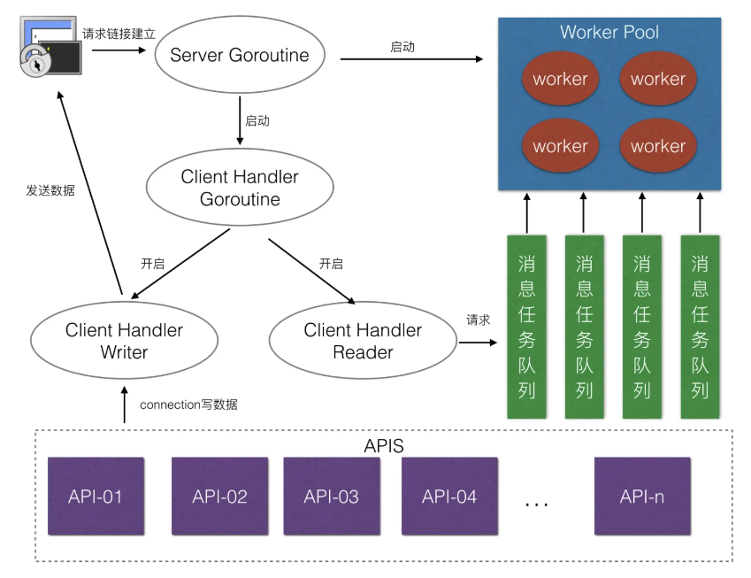
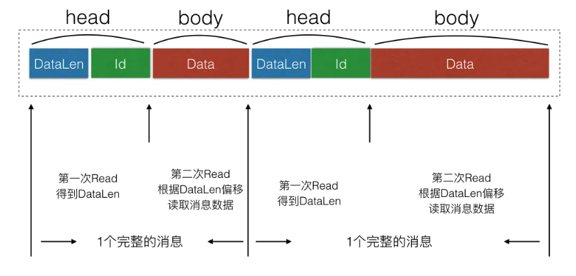
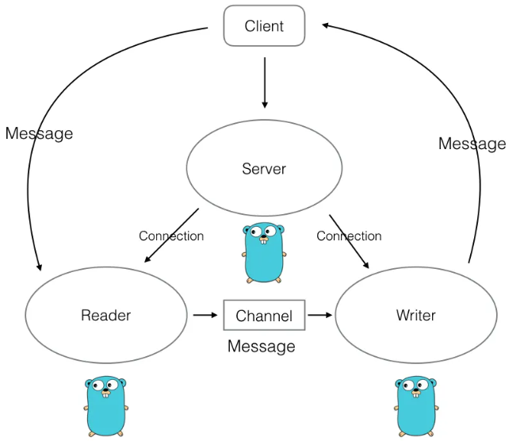
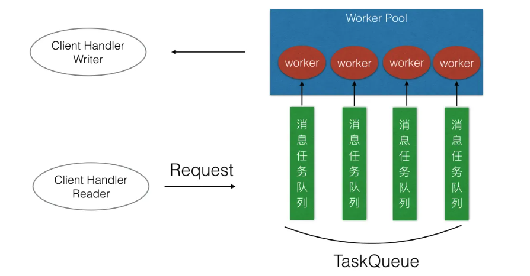
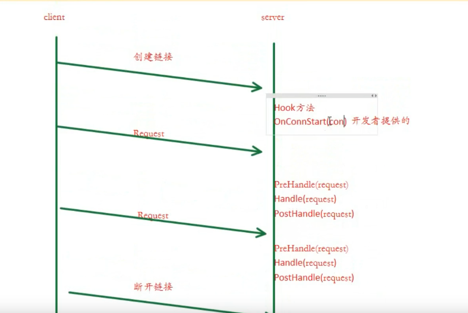
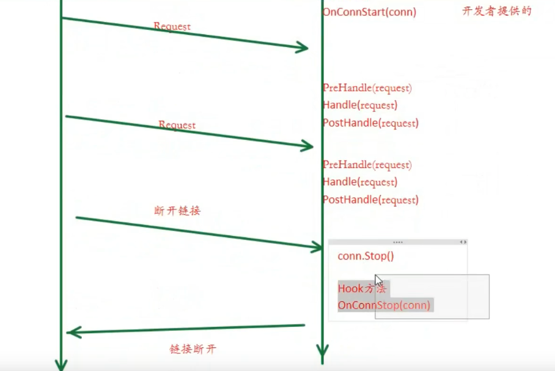

## Zinx 架构

## 接口与实现

ziface 存放抽象层接口

znet 存放具体实现

## Client 和 Server

### server

- go linseter：
  - 获取 TCP Addr ResolveTCPAddr()
  - 监听服务器地址 ListenTCP() 
  - for 阻塞等待 AcceptTCP()
  - go for 不断从客户端读取数据，make buf，conn.Read(buf)，conn.Write(buf)，go 启动链接业务

### client

- Dail 发起链接
- for 不断发送数据，不断从 conn 读取数据 conn.Read(buf)

## Connection 和 Request

对客户端链接和不同客户端链接所处理的不通业务再做一层接口封装

### connection

- 链接属性
  - socket TCP 套接字、链接 ID connID、链接状态 isClosed、new connection 执行链接处理方法 handleAPI、
- 链接方法
  - StartReader()，for 读取数据，调用当前链接绑定的业务 handleAPI
  - Start()，go StartReader()，for select 监听退出消息
  - Stop()，关闭 socket、通知 channel、关闭 channel

### Request

把 client 请求封装，存放额外的信息

- 属性
  - 请求对应的链接
  - 请求数据

## Router 模版设计模式

服务端应用可给 Zinx 配置当前链接的业务处理方法

设计

- 接口，空方法，具体实现接口
  - prehandler
  - handler
  - posthandler

Server

- 添加 Router 属性，NewServer 时可传入注册的 func
- 添加 AddRouter 方法

Connection

- 添加 Rouer 属性
- StartReader() 中调用 ruoter 的 handler 方法

## 全局配置

ini()方法，初始化 GlobalObj，并从配置文件中 reload Unmarshal 配置

## TCP 粘包问题 — 消息的封装

tcp 面向字节流，可以保证顺序、可靠

但是同时发送多个消息，TCP 粘包，如何区分两个消息的边界？

需要在应用层封装，处理包的头尾，知道是一个数据包

先读取固定长度 head，得到后续 Data 的长度，再根据 DataLen 读取后面的 body

### TLV 格式

每个消息前添加消息头

假设消息头 8 bytes，先读取 8 bytes，其中前 2 bytes 表示消息体长度

然后再偏移长度读取后面流数据，即可读到一个数据包

### Message

属性

- id
- datalen
- data

方法

- pack，创建 bytes 缓冲区，写 datalen、msgid、data
- unpack，读 datalen，读 msgid，根据 datalen 读数据

## 消息管理多路由模式

需求：当前只能绑定一个路由处理业务方法，无法满足基本的服务器需求

解决：map 路由管理器，根据消息 msgID 选择不同路由器处理不同业务逻辑

## 读写协程分离

并发编程模式，主要应用与 IO 密集场景

将**读操作**和**写操作**分配到不同的协程中处理，从而提高并发效率和代码可维护性。

### 优点

#### 并发性能

- 并发处理：读写同时进行，避免彼此阻塞。例如，读协程可以继续接收新请求，而写协程独立处理响应发送。
- **减少等待时间**：若读写混合在同一个协程中，写操作可能因网络缓冲满而阻塞，导致读操作被延迟。分离后，两者可独立调度。

#### 简化资源管理

- **避免锁竞争**：通过分离读写，可以减少共享资源的锁竞争。例如，读协程和写协程可以各自持有缓冲区，通过通道（Channel）或队列通信，而非直接共享可变状态。
- **降低死锁风险**：读写逻辑解耦后，复杂的锁依赖减少，更不易出现死锁。

#### 增强代码可维护性

- **职责清晰**：读协程专注协议解析、请求验证；写协程专注数据组装、响应发送。符合单一职责原则。
- **易于扩展**：可独立优化读写逻辑（如调整缓冲区大小、重试机制），而不影响对方。

#### 提高系统稳定性

- **错误隔离**：若写操作因网络问题变慢或阻塞，读操作仍可继续接收请求（需配合超时和流量控制）。反之亦然。
- **优雅降级**：可独立实现读写端的错误处理（如写失败重试、读超时丢弃）。

#### 优化资源利用

- **灵活调度**：读写协程可分配不同的CPU时间片或运行在不同线程上（如Go的GMP模型）。
- **缓冲控制**：可为读写设置独立缓冲区，避免一方数据积压影响整体吞吐。

#### 适用场景示例

- **TCP服务器**：读协程处理请求解码，写协程异步发送响应。
- **消息队列消费者**：读协程拉取消息，写协程将处理结果写入数据库。
- **代理服务**：分离客户端读写和后端服务读写，实现双向流转发。

#### 需要注意的挑战

- **数据一致性**：需确保读写协程间的状态同步（如使用原子操作或消息传递）。
- **流量控制**：需避免读协程生产数据过快导致写协程堆积（如通过带缓冲的通道或背压机制）。
- **复杂调试**：异步逻辑可能增加调试难度，需合理记录日志和跟踪协程生命周期。

#### 总结

读写协程分离通过**解耦并发职责**，在I/O密集型应用中能显著提升吞吐量、降低延迟，并改善代码结构。但需注意合理设计通信机制和错误处理，避免引入新的复杂性。

connection

- 增加无缓冲 channel，用于两个读写 goroutine 通信
- Reader 将客户端数据发送至 channel，而不是直接写回 conn.Write

- Writer for select 监听 channel，有数据则写给客户端

- Start() 启动 Reader() 和 Writer 的 Goroutine

## 消息队列和任务处理机制

### 为什么？

若有 10w 个 client 链接过来，则有 10w 个 reader 和 writer Goroutine，没有消息则阻塞，虽然 go 调度算法效率已经很极致，但 10w 个 goroutine 启停和切换调度，会浪费很大系统资源

可不可以不管 client 请求量多大，固定 10 个 Goroutine，CPU 只切换调用这 10 个 Goroutine，可以节省系统资源

### worker 池

worker 协程池，保证 goroutine 不会大量创建销毁，减小协程创建销毁的资源开销

属性

- apis，每个 msgid 对应的处理方法
- workerpoolsize，worker 池大小
- taskqueue []chan，worker 调度消息处理队列，chan 切片

启动 worker 工作池

- 根据 workerpoolsize 配置，创建任务消息队列数量
- go for select 监听任务消息队列的消息

## 链接管理

需求：限制链接数，超过后拒绝链接请求，保证后端的及时响应

### 链接管理模块

- 定义
- 属性
  - map 存储 Connection 链接集合
  - 针对 map 的互斥锁
- 方法，锁，defer 锁，操作
  - 增删
  - 查，根据链接 id
  - 查，当前链接总数
  - 清理所有链接

### 链接 hook 调用

需求：创建连接后和销毁前，提供客户端可用的 hook 方法

实现：

- 添加属性
  - 创建连接后，OnConnStart
  - 销毁连接前，OnConnStop
- 添加方法
  - 注册 OnConnStart 钩子函数的方法
  - 注册 OnConnStop 钩子函数的方法
  - 调用 OnConnStart 
  - 调用 OnConnStop
- Conn 创建后调用 OnConnStart 
- Conn 销毁前调用 OnConnStop

## 1.0 链接属性配置

需求：使用链接处理时，希望和链接绑定一些用户的数据或参数

Connection 模块新增：

- 属性
  - 链接属性集合，map
  - map 锁
- 方法
  - 增删改查